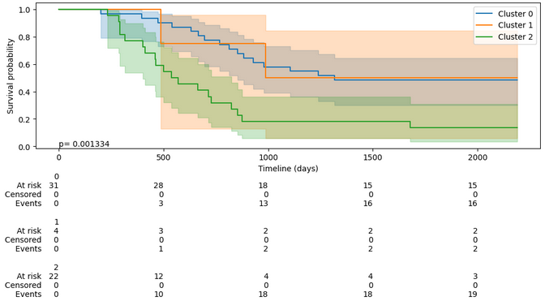

# Deep clustering validation using an external dataset

This repository includes the code and results of the deep clustering validation using an external dataset.

Kaplan-Meier analysis of the survival differences between clusters in the external dataset.
